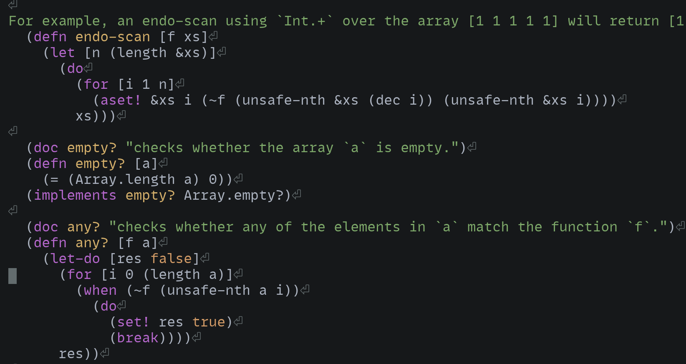

# tree-sitter-carp

Tree-sitter parser for Carp language.

## Highlights



# Install

## Helix

Add the following to your languages.toml

```toml

[[language]]
name = "carp"
scope = "source.carp"
file-types = ["carp"]
comment-token = ";"
indent = {tab-width = 2, unit = " "}
roots = []

[[grammar]]
name = "carp"
source = {git = "https://github.com/titan/tree-sitter-carp", rev = "master"}
```

and

```toml
use-grammars = {only = [..., "carp"]}
```

Then build the parser

```sh
helix --grammar fetch
helix --grammar build
```

After that, go to helix runtime directory, and copy highlight query files to queries directory

```sh
cd /var/lib/helix/runtime/
cp -r grammars/sources/carp/queries queries/carp
```

Finally, open carp files in helix and enjoy it. :-)